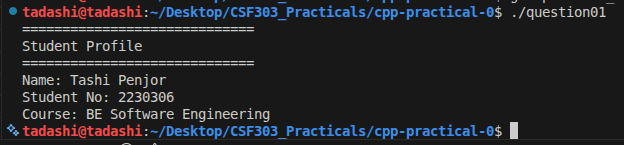
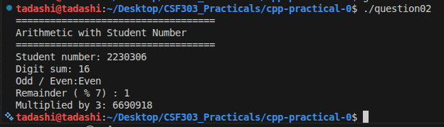
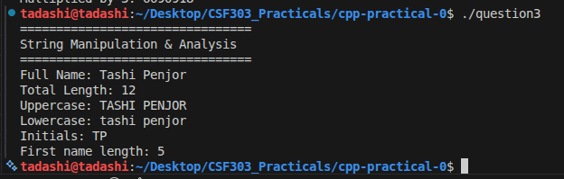
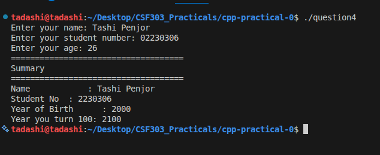
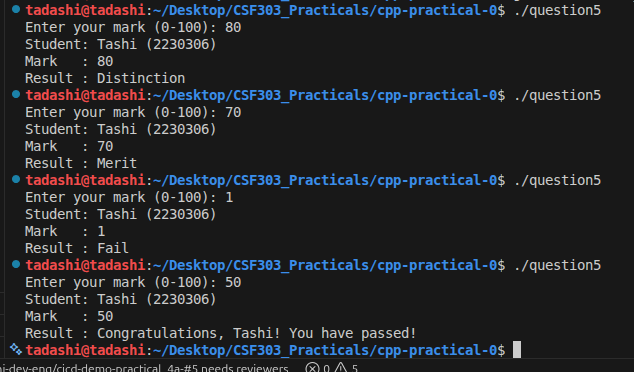
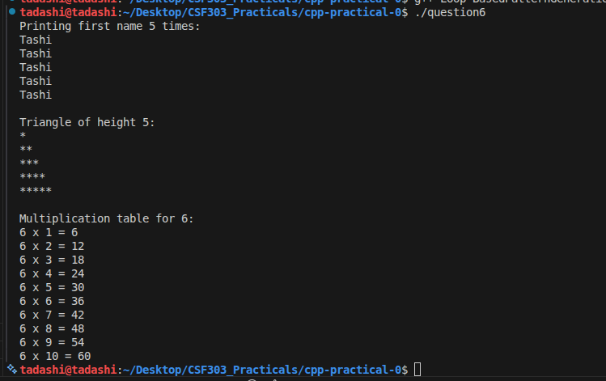
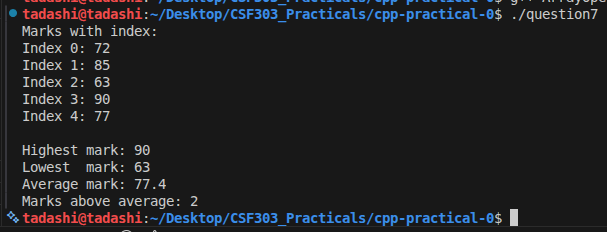
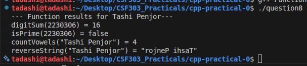
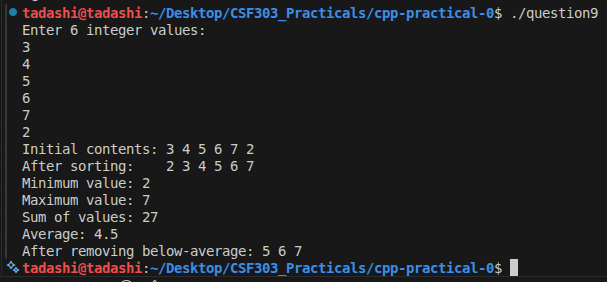
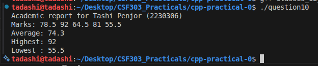

## Q01 Personal Introduction Output
Declaring and initializing variables of type string and int.

Outputting text and variable values with cout and stream manipulators (<< and endl).

A standard main function returning 0 to indicate successful execution.

## Q02 Arithmetic with Student Number

Basic I/O using std::cout and formatting with endl.

Digit processing: a while loop extracts each digit to compute the sum of digits.

Boolean logic: checks even/odd by inspecting studentNumber % 2.

Modular arithmetic: calculates the remainder when divided by 7.

Simple multiplication: multiplies the number by 3.

## Q03 String Manipulation & Analysis

Total length of the string using size().

Uppercase and lowercase versions by iterating over characters and applying toupper/tolower.

Initials: scans the name and collects the first character of each word.

Length of first name by locating the first space and using find.

## Q04 User Input & Type Conversion
Input gathering usesing "getline" for the name (to allow spaces) and cin for numeric values.

Current year is fetched with <ctime>:

Calculations:
birthYear = currentYear - age

hundredYear = birthYear + 100

## Q05 Conditional Grade Classification
Prompts the user to enter a mark between 0 and 100.

Validates the input to ensure it’s within the acceptable range.

If the mark is outside 0–100, it prints an error message and exits.

Classifies the mark using if, else if, else:

≥75 → Distinction

≥60 → Merit

≥40 → Pass

<40 → Fail

## Q06 Loop-Based Pattern Generation

First section uses a simple for loop counting up to the length of firstName.

Triangle utilizes a nested loop: outer loop for rows, inner loop for columns printing stars.

Multiplication table calculates the last digit via modulo and iterates 1–10 to show products.

## Q07 Function Design

Each feature is implemented as a separate function:

- `digitSum(int)` returns the sum of all digits of the integer.
- `isPrime(int)` performs a simple trial‑division check for primality.
- `countVowels(string)` scans the string counting `a,e,i,o,u` (case insensitive).
- `reverseString(string)` returns a new string reversed using `rbegin()/rend()`.

All functions are invoked with the hard‑coded student number and full name, and the results
are printed in a formatted summary.

(Source resides in `FunctionDesign.cpp`.)

## Q07 Array Operations & Statistics
Array Declaration: Created an int array named tadashi_marks with exactly five entries (hardcoded marks).

Index Listing: Used a for loop to print each value with its index.

Statistics:
Found the highest and lowest values using <algorithm> helpers.

Computed the average by summing and dividing by the count.

Counted how many marks were above the average.

## Q08 Function Design & Modular Programming
Breaking problems into self‑contained functions with clear input/output.

Using loops and basic string/number manipulation.

Demonstrating each function by calling it in main and displaying outputs.

Keeping the code readable with comments and simple formatting.

## Q09 Vector & Dynamic Collections
Creating and filling a dynamic container (vector<int>).

Traversing and printing vector contents.

Applying generic algorithms (sort, min_element, max_element, accumulate, remove_if).

Using lambda expressions for conditional removal.

Converting between numeric types for average calculation.

## Q10 Classes & Object-Oriented Design
Encapsulation: data hidden and manipulated only via methods.

Abstraction: Student hides implementation, exposing a clear interface.

Reuse and clarity: main() interacts with a clean object rather than raw data structures.

C++ STL use: vector container and algorithms for min/max.

